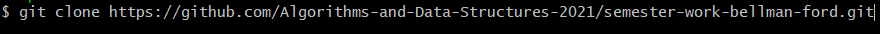
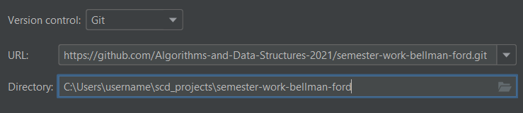
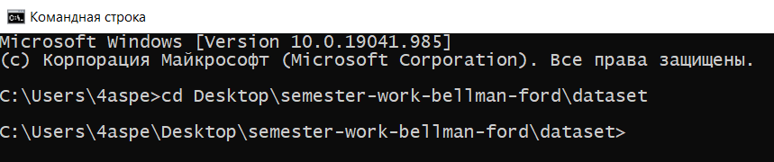
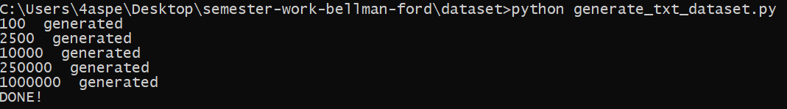
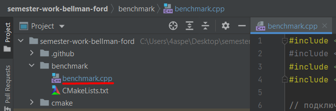
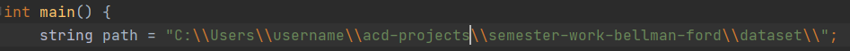
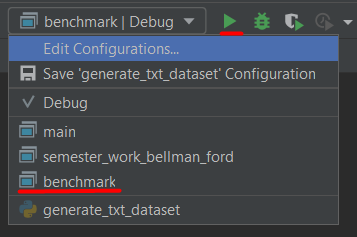
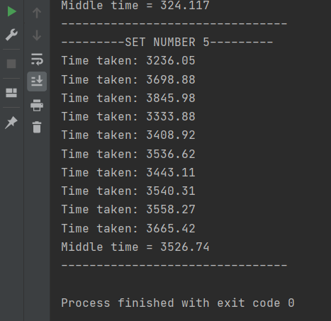

# Алгоритм Беллмана-Форда

[](https://github.com/Algorithms-and-Data-Structures-2021/semester-work-bellman-ford/actions/workflows/cmake.yml)


- **Алгоритм Беллмана-Форда** — алгоритм поиска кратчайшего пути во взвешенном графе.
- За время **O(V*E) = O(n^3)**(в худшем случае) алгоритм находит **кратчайшие пути** от одной вершины графа до всех остальных(V- количество вершин(), E - количество ребер).
- Алгоритм допускает рёбра с **отрицательным** весом.
- Предложен независимо Ричардом Беллманом и Лестером Фордом.
- Метод используется в некоторых протоколах дистанционно-векторной маршрутизации, например в RIP (Routing Information Protocol – Протокол маршрутной информации).

## <team_name>

| Фамилия Имя   | Вклад (%) | Прозвище              |
| :---          |   ---:    |  ---:                 |
| Илья Калимуллин   | 33,3        |  _ilya_               |
| Булат Сунгатуллин   | 33,3        |  _bulat_ |
| Паша Шумбасов   | 33,3        |  _pasha_         |

**Девиз команды**
> _В этой жизни ты либо волк, либо не волк☝_

## Структура проекта

Проект состоит из следующих частей:

- [`src`](src)/[`include`](include) - реализация структуры данных (исходный код и заголовочные файлы);
- [`benchmark`](benchmark) - контрольные тесты производительности структуры данных (операции добавления, удаления,
  поиска и пр.);
- [`examples`](examples) - примеры работы со структурой данных;
- [`dataset`](dataset) - наборы данных для запуска контрольных тестов и их генерация;

## Требования (Prerequisites)

1. С++ компилятор c поддержкой стандарта C++17 (например, _GNU GCC 8.1.x_ и выше).
2. Система автоматизации сборки _CMake_ (версия _3.12.x_ и выше).
3. Интерпретатор _Python_ (версия _3.7.x_ и выше).
4. Рекомендуемый объем оперативной памяти - не менее 8 ГБ.
5. Свободное дисковое пространство объемом ~ 3 ГБ (набор данных для контрольных тестов).
6. Clion или Visual Microsoft Visual Studio.

## Сборка и запуск

### Пример (с использованием IDE CLion)

#### Сборка проекта

- 1 способ:
  - Склонируйте проект к себе на устройство через [Git for Windows](https://gitforwindows.org/):
  ```shell
  git clone https://github.com/Algorithms-and-Data-Structures-2021/semester-work-bellman-ford.git
  ```
    
- 2 способ:
  - Откройте проект в [CLion](https://www.jetbrains.com/ru-ru/clion/), используя URL:
  ```shell
  https://github.com/Algorithms-and-Data-Structures-2021/semester-work-bellman-ford.git
  ```
    

#### Генерация тестовых данных

Генерация тестового набора данных в
формате [Text file(TXT)](https://en.wikipedia.org/wiki/Text_file):

- Процесс генерации тестовых данных:
  - откройте командную строку(на windows - клавиши *Win+R* и в появившемся окне введите *cmd* после чего нажмите Enter )
  - перейдите в dataset (cd <путь к проекту>\dataset) 
  
  - пропишите **python generate_txt_dataset.py** (python3 generate_txt_dataset.py) и нажмите *Enter*
  
  - подождите пока сгенерируются все данные  

Тестовые данные представлены в TXT формате (см.
[`dataset/data/dataset-example.txt`](dataset/data/dataset-example.txt)):

```txt
4
-2 5 -1 0
7 8 -6 -2
9 -10 7 0
5 -3 2 -1
```

**Примечание**. Данные для удобства запуска контрольных тестов организовываются так:

```shell
dataset/data/
  100/
    1.txt
    ...
    10.txt
  2500/ ...
  ...
  1000000/ ...
``` 

#### Контрольные тесты (benchmarks)

- Процесс измерения по времени тестовых данных:
  - Для запуска контрольных тестов необходимо предварительно сгенерировать или скачать готовый набор тестовых данных(data) по [ссылке](https://drive.google.com/drive/folders/1W3m0elMq0heuOrXoonPwX7AwhUVgMf-9).
  - откройте проект в [CLion](https://www.jetbrains.com/ru-ru/clion/)  
  - при скачивании набора замените папку data новым скаченным data  
  - перейдите в benchmark и откройте **benchmark.cpp**  
  
  - определите путь до проекта  
   
  - запустите **benchmark.cpp**  
  
  - подождите пока тест пройдут все данные  
  


##### Список контрольных тестов

| Название                  | Описание                                | Метрики         |
| :---                      | ---                                     | :---            |
| `benchmark`               | поиск кратчайшего пути                  | _время_         |


## Примечание  
С презентацией, видео-презентацией, отчетом, готовым набором тестовых данных можете ознакомиться, перейдя по ссылке на [Google Drive](https://drive.google.com/drive/folders/1PiHIfe6X6QVGhk4UvzKDSthmIEz3wM4r). 

## Источники

1. [Материал из Википедии](https://ru.wikipedia.org/wiki/%D0%90%D0%BB%D0%B3%D0%BE%D1%80%D0%B8%D1%82%D0%BC_%D0%91%D0%B5%D0%BB%D0%BB%D0%BC%D0%B0%D0%BD%D0%B0_%E2%80%94_%D0%A4%D0%BE%D1%80%D0%B4%D0%B0#:~:text=%D0%B0%D0%BB%D0%B3%D0%BE%D1%80%D0%B8%D1%82%D0%BC%20%D0%BD%D0%B0%D1%85%D0%BE%D0%B4%D0%B8%D1%82%20%D0%BA%D1%80%D0%B0%D1%82%D1%87%D0%B0%D0%B9%D1%88%D0%B8%D0%B5%20%D0%BF%D1%83%D1%82%D0%B8%20%D0%BE%D1%82,%D0%A0%D0%B8%D1%87%D0%B0%D1%80%D0%B4%D0%BE%D0%BC%20%D0%91%D0%B5%D0%BB%D0%BB%D0%BC%D0%B0%D0%BD%D0%BE%D0%BC%20%D0%B8%20%D0%9B%D0%B5%D1%81%D1%82%D0%B5%D1%80%D0%BE%D0%BC%20%D0%A4%D0%BE%D1%80%D0%B4%D0%BE%D0%BC.)
2. [Статья из Хабра](https://habr.com/ru/company/otus/blog/484382/)
3. [Материал из онлайн-школы Фоксфорд](https://foxford.ru/wiki/informatika/algoritm-forda-bellmana)
